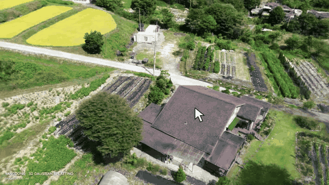
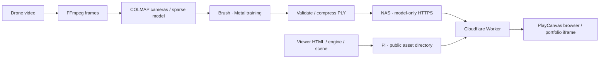

# Drone Gaussian Pipeline

[](https://github.com/BlueStylo/drone-gaussian-pipeline/actions/workflows/ci.yml)

직접 촬영한 드론 영상으로 집과 주변 동네를 복원하고, 브라우저에서 둘러볼 수 있도록 만든 **Apple Silicon 기반 Gaussian Splatting 제작·검증·웹 배포 파이프라인**입니다.

[**실제 3D 둘러보기 ↗**](https://yangdong-3d.yangdong-3d-public-proxy.workers.dev/)
· [제작 과정과 측정 결과](docs/results.md)
· [7단계 개발 이력](docs/history.md)



GIF는 실제 웹 뷰어의 조작 시연입니다. 링크를 열면 직접 회전·확대·시점 이동을 할 수 있습니다. 공개 모델은 약 104MB입니다. 모델은 NAS에서, HTML·엔진 등 뷰어 자산은 Raspberry Pi에서 제공하므로 두 서버의 가동과 인터넷 연결이 필요합니다.

**2026-09-21 모델 전달 개선:** 공개 주소를 유지하면서 모델을 NAS의 전용 HTTPS 원본으로 옮겼습니다. 기존 공개 주소에서 103.5MB 전체 다운로드를 약 14.9초에 완료하고 원본 SHA-256 일치를 확인했습니다. 다운로드 시간이며 브라우저의 모델 해석·GPU 준비 시간은 별도입니다. [측정 기록](evidence/model-delivery.json) · [배포 구성](docs/deployment.md#optional-separate-model-origin)

## 구현한 것

- **처리 자동화:** 영상 구간 manifest, 프레임 추출, COLMAP 정합, Brush 실행, 단계별 기록과 완료 단계 재사용.
- **동네 확장:** 기존 집의 이미지·정합 데이터를 복사해 추가 촬영분을 연결하고, 통합 Gaussian 모델을 새로 학습.
- **검증과 압축:** 카메라 정렬 비교, PNG 기반 평가, Gaussian 개수·SH 차수·원본 해시를 보존하는 압축 검사.
- **웹 전달:** 6개 시점과 마우스·터치·키보드 조작, 공개 자산 허용 목록, 스트리밍·부분 요청·캐시 검증, 지정 포트폴리오의 iframe 허용.

FFmpeg·COLMAP·Brush·PlayCanvas·SplatTransform을 사용합니다. 이 저장소의 기여는 이 도구들을 연결하는 실행·검증 코드와 웹 뷰어·배포 구조입니다. [도구와 코드 출처](docs/provenance.md)



## 실제 제작 결과

| 항목 | 기록 |
| --- | ---: |
| 입력 영상 / 등록 프레임 | 3개 / 682장 모두 등록 |
| 학습 장비 | Mac M1 Pro · 32GB |
| 최종 학습 | 12,000단계 · 약 47분 57초 |
| Gaussian 수 | 1,688,991개 |
| 모델 크기 | 398.6MB → 103.5MB, 약 74.03% 감소 |
| 최종 확장 실행 | 전처리 약 25분 + 학습 약 48분 |

시간은 **기존 집의 389장과 정합 데이터를 재사용한 최종 동네 확장 실행**의 기록입니다. 최초 집 복원·촬영·설치·압축·배포 시간은 포함하지 않습니다. 압축에는 양자화 손실이 있으며 점 삭제는 하지 않았습니다. [단계별 측정값](evidence/reconstruction-timing.json)

## 로컬 검사와 실행

Python 3.13, Node.js 22.22 이상을 사용합니다. 아래 검사는 GPU나 원본 드론 영상 없이 실행합니다.

```sh
git clone https://github.com/BlueStylo/drone-gaussian-pipeline.git
cd drone-gaussian-pipeline
python3.13 -m venv .venv
source .venv/bin/activate
python -m pip install -r requirements.txt
npm ci --ignore-scripts
npm run check
```

- [설치와 시작](docs/setup.md): 본인 영상으로 실행하기 위한 FFmpeg·COLMAP·Brush 준비.
- [복원 CLI](docs/pipeline.md): manifest 입력, 출력 경로, 완료 단계 재사용, 추가 촬영분 연결.
- [웹 뷰어](docs/web-viewer.md): 엔진 준비, 모델 배치, 로컬 보기.
- [배포와 iframe](docs/deployment.md): Caddy 예제, Worker 설정, 모델 전용 원본 선택, 포트폴리오 연결.
- [검증·압축 도구](docs/validation-tools.md): 카메라 정렬, PNG 평가, PLY 검증.

## 저장소 구성

| 경로 | 역할 |
| --- | --- |
| `pipeline/`, `configs/` | 복원 실행기와 입력 예제 |
| `scripts/` | 엔진 준비, 결과 검증·압축, 공개 파일 검사 |
| `viewer/` | 정적 WebGL 뷰어와 공개 장면 설정 |
| `worker/`, `deploy/` | 공개 전달 프록시와 배포 예제 |
| `tests/`, `.github/workflows/` | 합성 입력 기반 검사와 CI |
| `docs/`, `evidence/`, `assets/` | 과정·측정 기록·시연 |

원본 영상·모델 바이너리·실행 DB·개인 설정은 Git에 포함하지 않습니다. 외부 도구는 설치해서 사용하며, 사진과 장면 데이터는 코드와 별도 권리 조건을 적용합니다.

## 검증 범위와 한계

현재 CI는 공개 파일 경계, Python·JavaScript 문법, 입력·재실행 조건, 합성 카메라 정렬, 작은 PLY의 실제 압축, 뷰어 준비, Worker의 요청·캐시 처리를 검사합니다. 원본 영상 전체의 GPU 학습과 실서비스 배포는 CI에서 실행하지 않습니다.

보존된 원본 작업에서는 실제 모델 렌더링과 공개 다운로드를 확인했습니다. 이번 공개용 CLI 정리본으로 전체 12,000단계 학습을 다시 실행한 것은 아닙니다. 나무·유리·가려진 면·먼 배경의 품질 한계가 있으며, 측량 정확도나 모바일·다수 동시 접속 성능을 보장하지 않습니다.

## 공개 이력

실제 제작은 2026년 9월 14일 샘플 검증, 9월 19일 드론 복원·동네 확장, 9월 21일 미디어·독립 주소·iframe 연결로 진행했습니다. **GitHub의 최초 7개 이슈와 PR은 남아 있는 코드와 실행 기록을 바탕으로 2026년 9월 21일 현재 날짜에 재구성한 공개 이력**입니다. 당시 커밋이나 독립적인 사람의 리뷰를 재현한 기록이 아닙니다.

AI 보조 구현과 자체 검토를 사용했습니다. 이후 새 변경도 이슈와 PR, 실제 실행한 CI 결과로 기록합니다. [이력 구분과 단계별 링크](docs/history.md)

## 라이선스

직접 작성한 코드·문서는 [MIT](LICENSE), 사진·GIF·장면 데이터는 [별도 미디어 조건](MEDIA_LICENSE.md)을 따릅니다. [외부 도구 고지](THIRD_PARTY_NOTICES.md)
