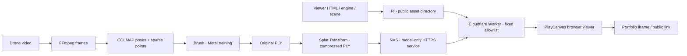

# 구조 · Architecture

복원은 Mac에서 실행하고, 결과의 공개 열람은 Raspberry Pi와 Cloudflare Worker가 담당한다. 브라우저에서 다시 학습하지 않는다.

2026년 9월 21일 모델 전송 원본을 NAS로 전환했다. 공개 URL은 유지했고 전체 모델 다운로드와 원본 해시 일치를 확인했다. [전송 검증 기록](../evidence/model-delivery.json)

## Reconstruction

프레임 추출, 특징·매칭, 카메라 정합, 렌즈 왜곡 보정, 학습을 단계별로 실행하고 소요 시간을 기록한다. 완료된 전처리를 재사용할 수 있게 구성했다. 학습 재실행은 optimizer checkpoint 복원으로 검증된 기능이 아니므로 새 학습 실행과 구분한다.

집과 동네를 연결할 때는 기존 집의 사진·특징 DB·희소 모델을 기준으로 새 촬영분을 정렬했다. 단순한 파일 병합보다 하나의 카메라 좌표계를 만드는 것이 중요했다. 최종 모델은 통합 입력으로 다시 학습했다.

## Viewer

PlayCanvas로 압축 PLY를 표시한다. 장면 설정에는 6개 시점과 기본 집 정면을 저장했다. 회전·이동·확대, 시점 선택, 초기화, 로딩·오류 안내를 제공한다. 촬영 프레임과 같은 시점의 비교는 모델의 모습을 판단하는 보조 수단이다.

원본 영상, COLMAP DB, 대용량 모델, 설치된 엔진은 Git 이력에 넣지 않는다. 공개 저장소에는 재현용 코드·설정 예시·측정 요약·작은 미디어만 보관한다.

## Public delivery

정적 원본은 공개 전용 경로에서 제한된 자산만 제공한다. 기존 비공개 서비스와 연결하는 범용 프록시를 만들지 않았다. Cloudflare Worker는 정확히 허용된 HTML·CSS·JS·JSON·PLY·라이선스·robots 파일만 GET/HEAD로 가져온다.

클라이언트 Cookie·Authorization을 원본으로 전달하지 않고, 원본의 리디렉션도 따라가지 않는다. 모델을 통째로 메모리에 읽지 않고 스트림으로 전달한다. ETag, 조건부 요청, HEAD, 단일·다중 Range의 전송 의미를 유지한다. 원본 URL은 배포 환경 설정으로 주입하고 저장소에는 넣지 않는다.

브라우저 캐시는 ETag와 `Cache-Control: public, max-age=0, must-revalidate`로 저장본을 재검증한다. 모델이 같고 저장본이 남아 있으면 304로 본문 전송을 생략할 수 있다. 캐시 삭제·새 브라우저·다른 출처에서는 모델을 다시 받는다. CDN에 영구 저장된 복제본이나 오프라인 사용을 보장하는 구조는 아니다.

### 모델 전용 원본 선택

선택 설정 `MODEL_BASE_URL`은 정확한 `model.ply` 요청만 별도 HTTPS 정적 원본으로 보낸다. 나머지 7개 자산은 기존 `ASSET_BASE_URL`을 유지한다. 설정을 생략하면 기존 원본 하나를 사용하며, 잘못된 설정이나 선택 원본의 장애를 이전 호스트로 숨겨서 우회하지 않는다. 원본 선택에는 사용자 입력을 사용하지 않는다.

NAS에는 모델만 읽기 제공하는 독립 서비스와 문서 루트를 사용한다. ownCloud·CCTV·다른 Caddy 서비스 설정은 이 경로에 포함하지 않는다. Worker가 접근할 수 있는 공개 HTTPS 주소가 필요하며, 작업용 Mac의 WireGuard 연결만으로 외부 접근 경로가 생기지는 않는다.

공개 주소·iframe·캐시 재검증 방식은 유지한다. NAS의 ETag가 달라지면 같은 모델도 한 번 다시 받을 수 있다. 별도 스토리지 가입은 필요 없지만 기존 서버의 비용과 업로드 대역폭·외부 연결 한도는 남는다. 이번 전환에서는 공개 Worker 경유 전체 다운로드가 약 14.9초였다. 이는 한 번의 전송 측정이며 브라우저 초기화 시간은 포함하지 않는다. [배포 조건과 검증](deployment.md#optional-separate-model-origin)

## Portfolio embed

공개 Worker의 `frame-ancestors`는 동일 출처와 `https://bluestylo.github.io`만 허용한다. CCTV나 정적 원본의 설정을 바꾸지 않고 공개 응답에 필요한 정책을 적용했다. 첫 다운로드가 약 104MB이므로 포트폴리오는 포스터·버튼을 먼저 표시하고 사용자가 요청하면 iframe을 생성하는 구성이 적합하다.

서버 헤더 검증과 실제 포트폴리오 iframe 완성은 별개다. 이 저장소의 배포 기록은 헤더 허용과 공개 뷰어 동작까지 확인한 스냅샷이다. [삽입 예시](media.md)

현재 모델 전송은 NAS에 의존하고, HTML·엔진 등 나머지 자산은 Pi가 필요하다. 원본을 변경할 때는 고정된 공개 설정과 전송 검증을 함께 갱신해야 한다.
