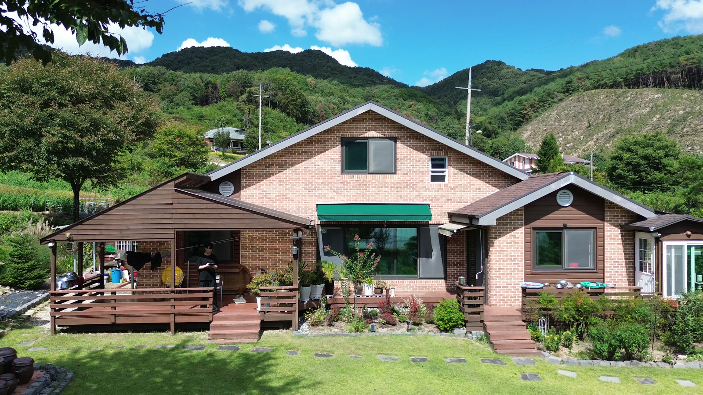
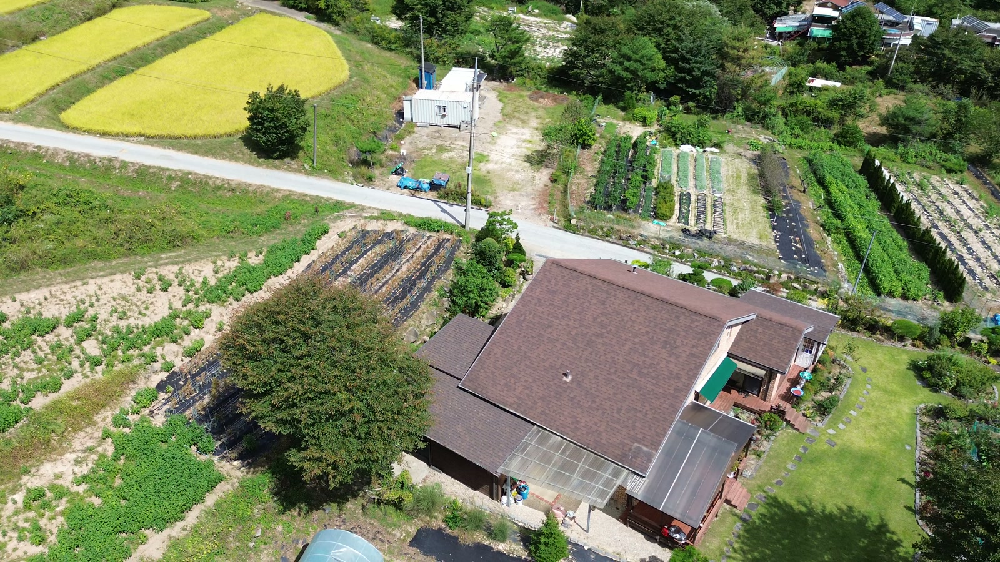
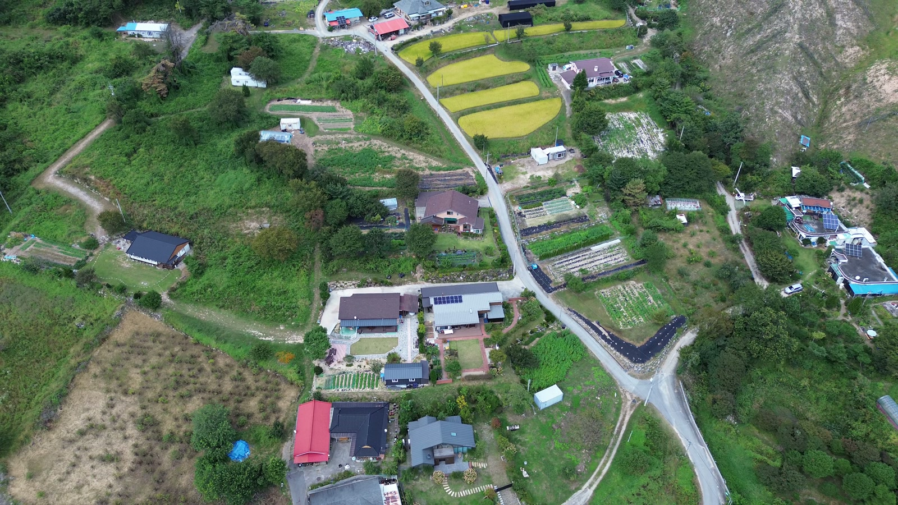

# 프로젝트 미디어 · Media

[직접 3D 둘러보기](https://yangdong-3d.yangdong-3d-public-proxy.workers.dev/)


이 GIF는 실제 압축 PLY를 렌더링한 뷰어의 시점을 마우스로 움직여 녹화한 **3D 조작 시연**이다. 2D 사진 변형이나 생성형 영상은 사용하지 않았다. GIF 자체를 드래그해 조작할 수는 없으며 위 공개 링크에서 실제 모델을 둘러볼 수 있다.

| 파일 | 내용 |
| --- | --- |
| `assets/yangdong-3d-hero.gif` | 480 × 270, 약 8fps, 8.38초, 4.92MB |
| `assets/yangdong-3d-poster.jpg` | 실제 가우시안 렌더에서 추출한 1280 × 720 포스터 |
| `assets/source-frame-house-front.jpg` | 입력 드론 영상의 집 정면 프레임 |
| `assets/source-frame-roof-garden.jpg` | 입력 드론 영상의 지붕·텃밭 프레임 |
| `assets/source-frame-neighborhood.jpg` | 입력 드론 영상의 주변 길·주택 프레임 |

포트폴리오용 원본 시연 MP4는 1280 × 720, 30fps, 13.97초다. GitHub에는 작은 GIF와 이미지만 포함했다. 원본 드론 영상, MP4, 103.5MB 모델을 저장소에 중복 보관하지 않는다. 유튜브 원본 영상의 실제 URL은 전달받아 확인한 뒤 추가할 예정이며 임시 링크를 게시하지 않았다.

## 입력 사진

아래 이미지는 가우시안 렌더가 아니라 실제 입력 영상에서 추출한 프레임이다.







## 포트폴리오 iframe

현재 공개 뷰어는 동일 출처와 `https://bluestylo.github.io`에서 삽입할 수 있다. 다른 도메인이나 localhost를 쓰려면 본인이 배포하는 Worker의 허용 출처를 명시적으로 설정해야 한다. GitHub README에서는 iframe 대신 GIF·일반 링크를 사용한다.

아래는 **사용자가 “3D 모델 불러오기”를 누른 뒤** 삽입할 HTML 예시다. `loading="lazy"`만으로 클릭 전 다운로드가 방지되는 것은 아니다.

```html
<iframe
  src="https://yangdong-3d.yangdong-3d-public-proxy.workers.dev/yangdong-3d/"
  title="양동면 3D 모델"
  loading="lazy"
  allow="fullscreen"
  allowfullscreen
  referrerpolicy="no-referrer"
  style="width:100%; aspect-ratio:16/9; border:0; min-height:360px;"
></iframe>
<a
  href="https://yangdong-3d.yangdong-3d-public-proxy.workers.dev/"
  target="_blank"
  rel="noopener noreferrer"
>새 창에서 3D 둘러보기</a>
```

부모 페이지에 CSP가 있으면 `frame-src`에서 Worker 출처도 허용해야 한다. 이 예시는 서버 삽입 정책을 설명하며 실제 포트폴리오 페이지 구현 완료를 주장하지 않는다. 미디어의 사용 범위는 [Media rights](../assets/LICENSE.md)를 확인한다.
